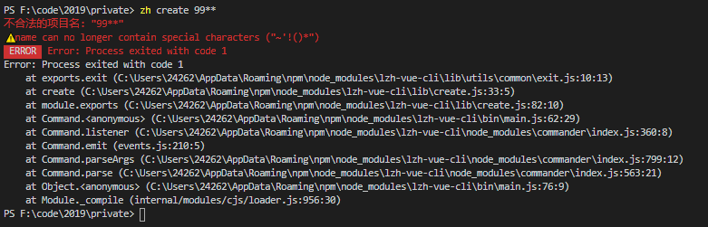
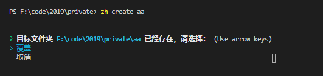
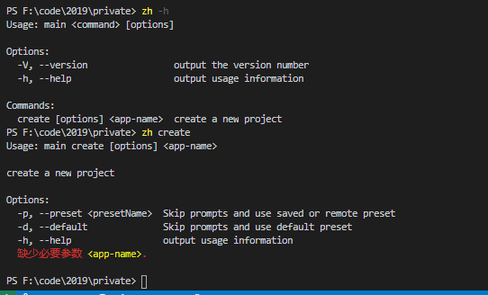
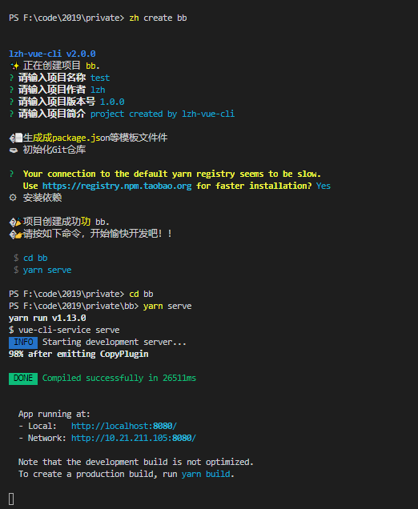

<!--
 * @message: 
 * @Author: lzh
 * @since: 2019-11-20 15:12:21
 * @lastTime: 2019-11-22 12:18:01
 * @LastAuthor: lzh
 -->
# lzh-vue-cli
个人搭建的vue脚手架工具

## 全局安装：
```
npm install lzh-vue-cli -global
```

## 创建项目：
```
zh create <project-name>
```

## 执行效果图：






